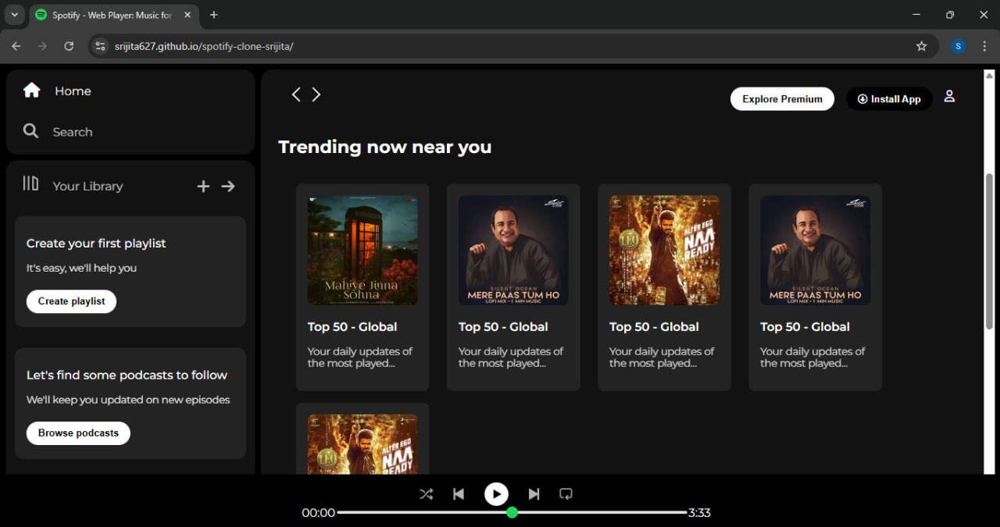

<h1 align="center">🚀 Hey, I'm Srijita!</h1>

  <b>Frontend Developer | Coding Enthusiast | Open Source Explorer</b> 
  Passionate about building creative and responsive user interfaces

---

## 🧠 About Me

- 🌱 Currently learning <b>HTML, CSS, JavaScript, React</b> and <b>Data Structures</b>  
- 🤝 Looking to collaborate on <b>Open Source Projects</b>  
- 🧠 Interested in <b>Frontend Development</b> and <b>UI/UX Design</b>  
- ✍️ Focused on <b>writing clean and efficient code</b>  
- 📍 Based in <b>New Delhi</b>  
- 🚀 Always eager to learn & grow in tech!  
- 📫 Let’s connect: [dattasrijita1@gmail.com](mailto:dattasrijita627@gmail.com)

---

## 🎵 Spotify UI Clone

A responsive frontend-only clone of Spotify built using **HTML** and **CSS**.  
🧩 Features a modern layout with interactive elements and mobile responsiveness.  

🔗 [Live Demo](https://srijita627.github.io/spotify-clone-srijita/)  
🔗 [Source Code](https://github.com/Srijita627/spotify-clone-srijita/)

---

## 🛠 Tech Stack

  

---

## 📊 GitHub Stats

  

  

  

---

<i>"Code. Learn. Build. Repeat."</i>

